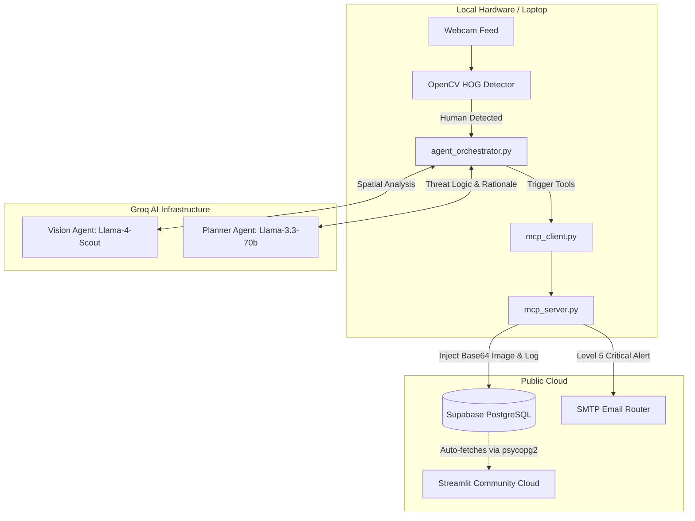

# 🛡️ Agentic Smart Surveillance System

<p align="center">


</p>

An **Edge-to-Cloud Agentic AI Surveillance System** that combines computer vision, multi-agent reasoning, and the Model Context Protocol (MCP) to intelligently monitor live camera feeds and autonomously respond to security events.

Instead of relying on simple motion detection, the system first performs lightweight human detection locally using OpenCV, then invokes a LangGraph-powered multi-agent workflow that understands the scene, evaluates threat severity, and executes appropriate actions such as logging incidents or sending email alerts.

---

# 🚀 Features

- 📹 Real-time webcam surveillance
- 👤 Human detection using OpenCV HOG Descriptor
- 🤖 Multi-agent reasoning with LangGraph
- 👁 Vision-language scene understanding
- 🧠 Threat severity analysis using LLMs
- 🔌 Model Context Protocol (MCP) integration
- 🗄 SQLite event logging
- 📧 Automatic email alerts with captured evidence
- 📊 Live Streamlit monitoring dashboard
- ⚡ Edge-to-Cloud AI pipeline

---

# 🏗 Architecture

The project follows an **Edge-to-Cloud architecture**.

### Edge Layer

The local system continuously monitors the webcam using OpenCV's Histogram of Oriented Gradients (HOG) descriptor.

Only when a human is detected does the system capture a frame and invoke the AI pipeline, reducing unnecessary API calls and minimizing false positives.

### Cloud Intelligence Layer

The captured image is analyzed by Vision Language Models through Groq.

The generated scene description is passed to a LangGraph orchestration workflow where specialized agents reason about the context, determine the threat level, and decide which tools should be executed.

### Tool Execution Layer

The AI agents do not directly interact with databases or email services.

Instead, they communicate through the **Model Context Protocol (MCP)**.

The MCP server exposes local tools including:

- SQLite logging
- Email notifications

This decoupled architecture separates AI reasoning from system execution, making the project modular and scalable.

---

# 🔄 Workflow



---

## 🛠️ Technology Stack

| Category | Technology |
| :--- | :--- |
| **Core Language** | Python 3.10+ |
| **Computer Vision** | OpenCV (HOG Descriptor) |
| **AI Orchestration** | LangGraph, LangChain |
| **Cloud Intelligence**| Groq API (Llama-4-Scout, Llama-3.3-70b) |
| **Tool Execution** | Model Context Protocol (MCP) |
| **Cloud Database** | Supabase (PostgreSQL) |
| **Frontend UI** | Streamlit Community Cloud |
| **Environment** | `python-dotenv` |
---

# 📂 Project Structure

```text
SMART_SURVEILLANCE/
│
├── temp_frames/              # Stores captured frames
├── venv/                     # Virtual environment
├── .env                      # Environment variables
├── agent_orchestrator.py     # LangGraph orchestration
├── app.py                    # Streamlit dashboard
├── gateway.py                # AI model gateway
├── live_surveillance.db      # Supabase (PostgreSQL)
├── mcp_client.py             # MCP client
├── mcp_server.py             # MCP server exposing tools
├── motion_detector.py        # OpenCV surveillance pipeline
└── README.md
```

---

# ⚙ Installation

Clone the repository

```bash
git clone https://github.com/yourusername/SMART_SURVEILLANCE.git

cd SMART_SURVEILLANCE
```

Create a virtual environment

Windows

```bash
python -m venv venv

venv\Scripts\activate
```

Linux/macOS

```bash
python3 -m venv venv

source venv/bin/activate
```

Install dependencies

```bash
pip install -r requirements.txt
```

---

# 🔑 Environment Variables

Create a `.env` file.

```env
GROQ_API_KEY=your_groq_api_key

SENDER_EMAIL=your_email@gmail.com

EMAIL_APP_PASSWORD=your_google_app_password

RECEIVER_EMAIL=receiver@gmail.com
```

---

# ▶ Running the Project

Start the surveillance pipeline

```bash
python motion_detector.py
```

Launch the monitoring dashboard

```bash
streamlit run app.py
```

---

# 🧠 Why LangGraph?

LangGraph enables the project to move beyond traditional rule-based programming by allowing AI agents to collaborate within a stateful workflow. Instead of relying on fixed `if-else` logic, agents dynamically analyze visual context, reason about threats, and determine the appropriate actions.

---

# 🔌 Why MCP?

The Model Context Protocol (MCP) decouples AI reasoning from tool execution.

Rather than directly writing to the database or sending emails, the AI communicates with an MCP server that exposes these capabilities as reusable tools. This separation improves modularity, maintainability, and scalability while reflecting modern enterprise AI system design.

---

# 📊 Dashboard

The Streamlit dashboard displays:

- Live surveillance events
- AI-generated scene descriptions
- Threat severity
- Incident history
- Logged alerts
- System status

---

# 🚀 Future Enhancements

- Face recognition integration
- Multi-camera surveillance
- RAG-based natural language querying of surveillance logs
- Telegram and Slack notifications
- Docker deployment
- Cloud database integration
- Mobile monitoring dashboard

---

# 🎓 Learning Outcomes

This project demonstrates practical implementation of:

- Agentic AI
- LangGraph
- LangChain
- Model Context Protocol (MCP)
- Multi-Agent Systems
- Vision Language Models
- Edge Computing
- Computer Vision
- Tool Calling
- Event-Driven Architecture
- Supabase (PostgreSQL)
- Streamlit

---
# Live link:
https://agentic-surveillance-ui.streamlit.app/

---
# 👩‍💻 Author
**Ananya P Kotian**

Final-Year Computer Engineering Student

Built as a portfolio project demonstrating modern Agentic AI, LangGraph orchestration, MCP-based tool execution, and intelligent Edge-to-Cloud surveillance systems.
